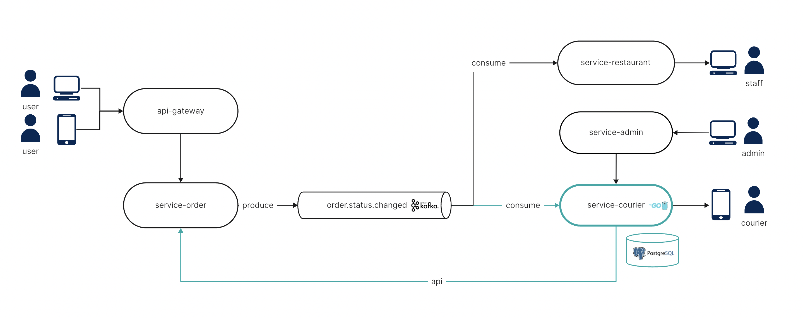
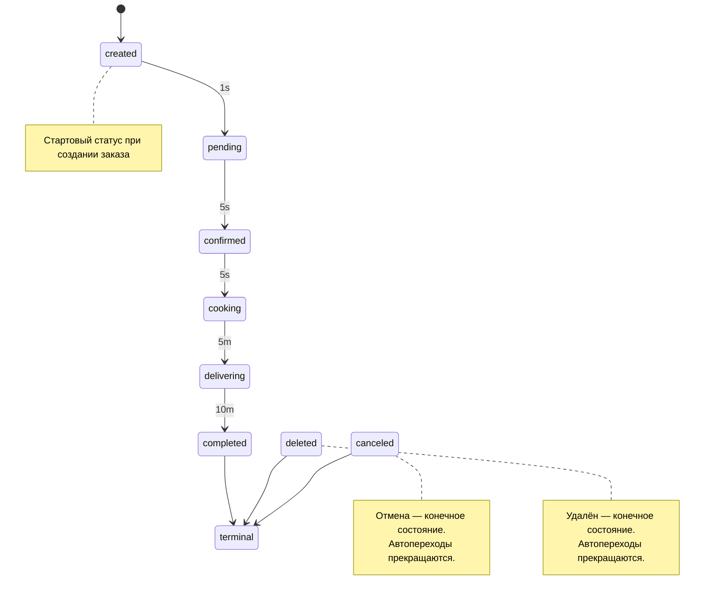

# Сервис заказов (test-only) 🚀

Учебный сервис для демонстрации подходов и задач курса. Лёгкий, минималистичный и удобный для локального запуска и экспериментов.

На схеме это service-order. Ученики разрабатывают service-courier.

---

## ⚠️ Важное предупреждение
- Это учебный (тестовый) сервис, собранный для демонстрации подходов и задач курса.
- Его не следует использовать как образец «красивого» или промышленного кода.
- Архитектурные и инженерные решения упрощены ради наглядности.

---

## ▶️ Запуск локально
- Требования: Docker/Docker Compose, Go 1.21+ (для запуска без контейнеров).
- Быстрый старт через Docker Compose:
  - make run — поднимет Kafka, Kafka UI и сам сервис на :8080
  - make logs — посмотреть логи сервиса
  - make down — остановить и удалить контейнеры
- Сервис слушает порт 8080, если такой порт уже занят, порт можно изменить в main.go 
- Базовый префикс API: /public/api/v1

Примеры команд:
```bash
# Запуск кластера и сервиса
make run

# Просмотр логов
make logs

# Остановка и очистка
make down
```

---

## 🧰 Технологии и стек
- Язык: Go
- HTTP роутер: go-chi/chi
- DI (внедрение зависимостей): uber-go/dig
- Сообщения/события: Kafka Producer (Sarama, при наличии KAFKA_BROKERS)
- Хранилище: In-Memory репозиторий (без базы), см. internal/repository/order
- Архитектурные слои: domain, usecase, repository, gateway, handlers (упрощённая clean-структура)
- Тесты: стандартный testing, testify/assert, упрощённые gomock-совместимые моки
- OpenAPI: api_openapi.yaml

---

## 🔐 Аутентификация и заголовки
Поддерживаются заголовки (для учебных сценариев):
- X-User-ID — идентификатор пользователя (строка)
- X-Bypass-Auth=true — режим обхода, симулирует пользователя "default-user"

Особенности:
- GET-ручки (получение заказа и статуса, а также список) не требуют обязательного X-User-ID. Если заголовок не передан, доступ к чтению не блокируется (публичный просмотр в учебных целях).
- Модифицирующие операции (создание/обновление/удаление) используют переданный userID и проверяют владение.

---

## 📡 HTTP ручки
Базовый префикс: /public/api/v1

### 1) Создать заказ
- POST /order
- Заголовки: рекомендуется X-User-ID или X-Bypass-Auth=true
- Тело (JSON):
```json
{
  "restaurant_id": "rest-1",
  "items": [{"food_id":"f1","name":"Pizza","quantity":1,"price":500}],
  "total_price": 500,
  "address": {"street": "Main"}
}
```
- Ответ 201: объект заказа

Пример:
```bash
curl -X POST http://localhost:8080/public/api/v1/order \
     -H 'Content-Type: application/json' \
     -H 'X-Bypass-Auth: true' \
     -d '{"restaurant_id":"rest-1","items":[{"food_id":"f1","name":"Pizza","quantity":1,"price":500}],"total_price":500,"address":{"street":"Main"}}'
```

### 2) Получить заказ по ID
- GET /order/{id}
- Заголовки: опционально X-User-ID или X-Bypass-Auth=true
- Ответ 200: объект заказа

Пример:
```bash
curl http://localhost:8080/public/api/v1/order/ORDER_ID
```

### 3) Получить статус заказа
- GET /order/{id}/status
- Ответ 200: {"order_id":"...","status":"..."}

Пример:
```bash
curl http://localhost:8080/public/api/v1/order/ORDER_ID/status
```

### 4) Список заказов с момента времени
- GET /orders?from=RFC3339
- Параметры: from — ISO/RFC3339-строка (по умолчанию 1970-01-01T00:00:00Z)
- Ответ 200: массив заказов

Пример:
```bash
curl 'http://localhost:8080/public/api/v1/orders?from=1970-01-01T00:00:00Z'
```

### 5) Обновить заказ
- PUT /order/{id}
- Заголовки: X-User-ID или X-Bypass-Auth=true
- Тело (JSON): любые изменяемые поля (fio, items, total_price, address)
- Ответ 200: объект заказа

Пример:
```bash
curl -X PUT http://localhost:8080/public/api/v1/order/ORDER_ID \
     -H 'Content-Type: application/json' \
     -H 'X-Bypass-Auth: true' \
     -d '{"fio":"Ivanov I.I."}'
```

### 6) Удалить заказ
- DELETE /order/{id}
- Заголовки: X-User-ID или X-Bypass-Auth=true
- Ответ 200: {"id":"...","status":"deleted"}

Пример:
```bash
curl -X DELETE http://localhost:8080/public/api/v1/order/ORDER_ID -H 'X-Bypass-Auth: true'
```

### 7) Отладочное заполнение данными (seed)
- POST /debug/seed
- Заголовки: X-User-ID или X-Bypass-Auth=true
- Создаёт N=10 демо-заказов для текущего пользователя
- Ответ 201: массив созданных заказов

Пример:
```bash
curl -X POST http://localhost:8080/public/api/v1/debug/seed -H 'X-Bypass-Auth: true'
```

---

## 🧭 Замечания по поведению
- Статусы заказов автоматически прогрессируют во времени фоновой задачей (см. cmd/service/main.go): created → pending → confirmed → cooking → delivering → completed с учебными интервалами.
- В In-Memory репозитории данные живут только в памяти процесса.

---

## 🗺️ Диаграмма статусов и тайминги
Ниже — визуализация статусной модели заказа и времени автоматических переходов (на базе кода internal/repository/order/repo.go::AdvanceStatuses):



Пояснения:
- created устанавливается при создании заказа.
- Дальнейшие переходы выполняет фоновый воркер каждые 500мс (см. cmd/service/main.go: runStatusWorker) согласно правилам:
  - created —через 1s→ pending
  - pending —через 5s→ confirmed
  - confirmed —через 5s→ cooking
  - cooking —через 5m→ delivering
  - delivering —через 10m→ completed
- canceled и deleted — терминальные статусы. Если заказ переведён в один из них, автоматические переходы прекращаются.

Примечание: В domain перечислены дополнительные статусы (например, delivered), но в текущей учебной логике авто-процессинг не использует их напрямую — финальной точкой является completed.

---

## 🗂️ Файлы и полезные ссылки
- OpenAPI: [api_openapi.yaml](./api_openapi.yaml)
- Диаграмма ручек (PlantUML): [api_endpoints.puml](./api_endpoints.puml)
- Тесты: internal/handlers/*_test.go, internal/usecase/order/*_test.go
- Makefile: цели run, logs, down, test, lint
- Docker Compose: [docker-compose.yaml](./docker-compose.yaml)

---

## 📄 Лицензия и ответственность
Код предоставлен «как есть» исключительно для учебных целей. Используйте на свой страх и риск. 🙏